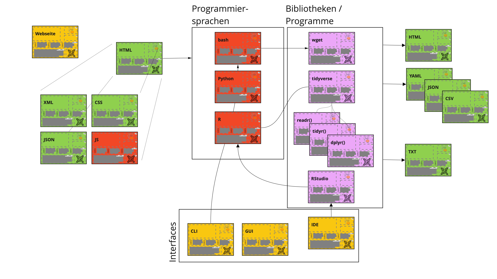

Dieser Ordner enthält die Daten zu unserem metaphorischen Werkzeugregal. Dahinter steht die Idee die Metaphern von Werkzeugen, Werkzeugkoffern, Werkzeugregalen, Blackboxes mit physischen Objekten pädagogisch nutzbar zu machen. So gibt es in unserem *Scholarly Makerspace* ein **Werkzeugregal** in dem sich **Werkzeugkisten** und **Blackboxes** befinden. Werkzeugkisten sind nach Typen (Kategorien) von Werkzeugen, z.B. "Programmiersprachen" oder "Dateiformate", und Blackboxes nach Themen, z.B. "Web Scraping" oder "Distant Reading", gepackt.

Der Begriff des Werkzeuges ist hier so weit wie möglich gefasst und umfasst Methoden, Konzepte, Software, Sprachen, Hardware etc.

# Ordnerstruktur

- `Blackboxes/`: Ordner für von uns gepackte / vorbereitete Blackboxes. Für jede Blackbox gibt es 
    + eine YAML Datei (`blackbox.yml`) und 
    + eine visuelle Übersicht über den Inhalt und wie er zusammengehört (`blackbox_schema.jpg`). 
- `Werkzeuge/`

# Werkzeuge

Dabei gibt es pro Werkzeug eine Datei. Diese soll eine Kurzbeschreibung und weiterführende Links enthalten. Dafür wird es ein template geben. Um das Auflösen von URLs zu erleichtern, sind die Dateinamen einfach `[WERKZEUG].md` also z.B. `docker.md`. Weitere Informationen bzw. andere Arten von Informationen zu Werkzeugen werden mit funktionalen Zusätzen zum Dateinamen markiert, wie z.B. `_tutorial`. Entwürfe werden mit dem Zusatz `_draft` versehen.

## Setkarten

Jedes Werkzeug wird durch eine Setkarte dargestellt.


Jede Setkarte enthält die folgenden Informationen:

- Name
- Icon: kann über Wikidata oder TAPoR gefunden werden.
- QR Code: verweist auf eine feste URI; erlaubt das Ergebnis mit dem Handy zu scannen und weiterzuverarbeiten
- ID(s)
    + unsere
    + Wikidata
    + TAPor
- Kategorien
    + gemäß TaDiRAH?
    + unsere?
- Kurbeschreibung: kann von Wikidata oder/und TAPoR übernommen werden. Es besteht die Möglichkeit darüber Setkarten in verschiedenen Sprachen zu erzeugen
- Literatur: aus Zotero übernommen
- Weiterführende Links
- Input und Output

Die Farbgebung codiert eine basala Kategorisierung. Die Verteilung der Informationen auf Vorder- und Rückseite steht noch nicht fest.

Blackboxes können ähnliche Setkarten bekommen


## Erstellung der Setkarten

Wir stellen uns einen mehrheitlich automatisierten Prozess der Erstellung der Setkarten auf der Basis der Informationen in unserer *tool registry* (eine große YAML Datei) vor.

 

# Blackboxes

Für jede Blackbox gibt es eine YAML-Datei und eine visuelle Übersicht über den Inhalt und wie er zusammengehört. Dieser macht von der schematischen Ansicht unserer Setkarten Gebrauch.



Die YAML-Datei kann entweder ein vollständiges Subset unserer *tool directory* sein oder stark reduziert. In letzterem Fall muss sie für die Menschenlesbarkeit immer auch einen Namen enthalten.

```yaml
--- 
methods:
- name: Web scraping
  category: method
  wikidata: https://www.wikidata.org/wiki/Q665452

concepts:
- name: Webseite
  category: concept
  wikidata: https://www.wikidata.org/wiki/Q35127
- name: IDE
  expansion: Integrated Development Environment
  category: concept
  wikidata: https://www.wikidata.org/wiki/Q13741

languages:
- name: CSV
  category: serialization
  wikidata: https://www.wikidata.org/wiki/Q935809
- name: HTML
  expansion: Hypertext Markup Language
  wikidata: https://www.wikidata.org/wiki/Q8811
  category: 
    - language
    - serialization
software:
- name: Bash
  expansion: Bourne again shell
  wikidata: https://www.wikidata.org/wiki/Q189248
- name: wget
  category: 
    - software
    - command line utility
  wikidata: https://www.wikidata.org/wiki/Q535461
  tapor: https://tapor.ca/tools/1280
```